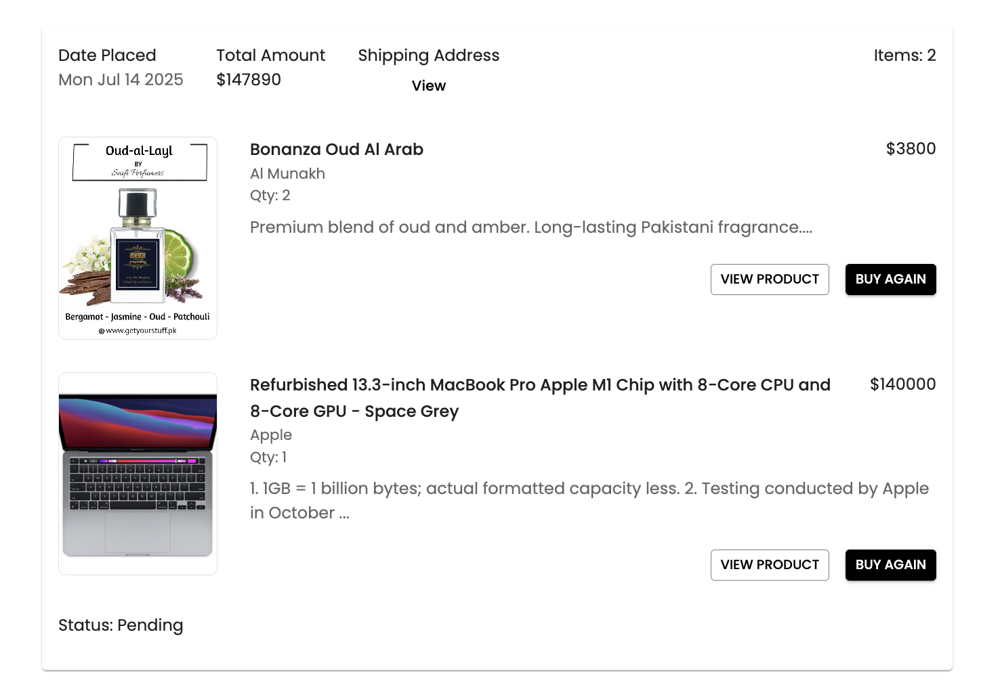

# MERN E-commerce Platform

  

Check out my complete portfolio for more projects and professional experience! 🚀

A comprehensive e-commerce solution built with the MERN stack (MongoDB, Express.js, React, Node.js), featuring Redux Toolkit for state management and Material UI for a modern, responsive interface.

## 🌟 Key Features

### 🛍️ Shopping Experience
- Product browsing with advanced filtering and search
- Detailed product views with specifications
- Shopping cart management
- Secure checkout process
- Order tracking and history
- Wishlist functionality

### 👤 User Features
- Profile management
- Multiple shipping addresses
- Order history
- Product reviews and ratings
- Wishlist management

### 🔐 Admin Dashboard
- Product management (CRUD operations)
- Order processing and tracking
- User management
- Sales analytics

## 📸 Project Showcase

### Homepage

### Product Details

### Shopping Cart

### Checkout Process

### Order Confirmation

### User Profile

### Order History

### Wishlist

### Admin Dashboard - Products

### Admin Dashboard - Orders

## 🛠️ Technology Stack

- **Frontend**: React.js, Redux Toolkit, Material UI
- **Backend**: Node.js, Express.js
- **Database**: MongoDB
- **Authentication**: JWT, OTP verification
- **State Management**: Redux Toolkit
- **UI Framework**: Material UI
- **Payment Integration**: Secure payment gateway integration

## 🔒 Security Features

- JWT Authentication
- OTP Verification
- Secure Password Reset
- Protected Admin Routes
- Input Validation
- XSS Protection

## 🎨 UI/UX Features

- Responsive Design
- Dark/Light Mode
- Intuitive Navigation
- Loading Animations
- Toast Notifications
- Form Validation
- Error Handling

## 📱 Mobile Responsive

The application is fully responsive and provides a seamless experience across all devices:
- Desktop
- Tablet
- Mobile

## Authors

- [@RishiBakshii](https://github.com/RishiBakshii)

## ⭐ Support

If you find this project helpful, please consider giving it a star! Your support helps make the project more visible to others.
